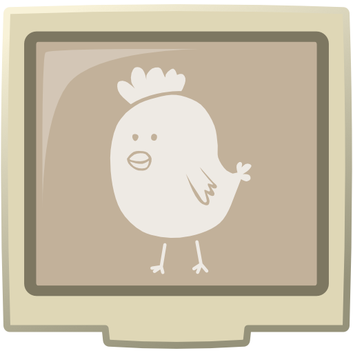

# 键盘乱点 | Khaonix

 Khaonix（键盘乱点）是世界第一款基于主流键盘布局的无轨下落式音乐节奏游戏。旨在提供当前PC端市场上最具街机感的音乐节奏游戏体验。
<!-- [![Chickensoft Badge][chickensoft-badge]][chickensoft-website] [![Discord][discord-badge]][discord] [![Read the docs][read-the-docs-badge]][docs] ![line coverage][line-coverage] ![branch coverage][branch-coverage]
C# Godot 4 游戏开发模板，内置调试配置、测试（本地与 CI/CD）、代码覆盖率、依赖更新检查与拼写检查，开箱即用！

---

<p align="center">

</p> -->

<!-- ## 😇👌 快速开始

本模板可帮助你快速创建基于 Godot 4 的 C# 游戏。使用 Microsoft 的 `dotnet` 工具即可轻松安装和生成项目。

```sh
# 安装模板
dotnet new install Khaonix

# 基于模板生成新项目
dotnet new chickengame --name "MyGameName" --param:author "My Name"

cd MyGameName
dotnet build
``` -->

## 📚 文档索引

- [测试指南](docs/测试指南.md)：测试代码结构、命名规范、常用片段说明
- [谱面及制谱器需求记录](docs/谱面及制谱器需求记录.md)：谱面数据结构与制谱器设计
- [谱面播放器需求记录](docs/谱面播放器需求记录.md)：谱面播放器功能需求
- [判定规则](docs/判定规则.md)：判定相关规则（待补充）
- [Git 提交指南](docs/git提交指南.md)：规范化的 Git 提交信息格式与建议

## 💁 获取帮助

*遇到问题或 C# 构建异常？* 请联系项目开发者 @Un_Z。

## 🏝 环境配置

为确保调试与测试覆盖率功能正常，请参考 [Chickensoft 环境配置文档][setup-docs] 配置 Godot 与 C# 开发环境。

### VSCode 设置

模板自带 `.vscode/settings.json`，优化了 Windows（Git Bash、PowerShell、CMD）与 macOS（zsh）终端体验，并修复了 Omnisharp 的部分语法高亮问题。包含 editor config 与 Roslyn 分析器相关设置，提升编码体验。

> 请确保这些设置不会与个人已有配置冲突。

## .NET 版本管理

[`global.json`](./global.json) 指定了 .NET SDK 与 `Godot.NET.Sdk` 版本，便于 [Renovatebot] 自动检测依赖更新。

## 👷 测试

示例测试位于 `test/src/GameTest.cs`，基于 [GoDotTest] 与 [godot-test-driver]，支持命令行运行、代码覆盖率收集与 VSCode 调试。

测试代码不会被打包进正式发布版本，CI/CD 环境下通过 [mesa] 虚拟显卡实现可视化测试。

## 🏁 程序入口

`Main.tscn` 与 `Main.cs` 为游戏入口。发布版会直接切换到 `src/Game.tscn`，调试/测试模式下则进入测试场景。

建议优先编辑 `src/Game.tscn`。

## 🚦 覆盖率

需先全局安装以下 dotnet 工具：

```sh
dotnet tool install --global coverlet.console
dotnet tool update --global coverlet.console
dotnet tool install --global dotnet-reportgenerator-globaltool
dotnet tool update --global dotnet-reportgenerator-globaltool
```

运行 `coverage.sh`（Windows 可用 Git Bash），或用 PowerShell 脚本 `coverage.ps1`。

## ⏯ 运行与调试

VSCode 提供多种启动配置：

- 🕹 **调试游戏**：常规调试
- 🎭 **调试当前场景**：自动加载与当前 C# 文件同名的场景
- 🧪 **调试测试**：调试所有测试
- 🔬 **调试当前测试**：调试与当前 C# 文件同名的测试类

> ⚠️ 需设置 `GODOT` 环境变量，详见 [Chickensoft 环境配置文档][setup-docs]。

## 🏭 CI/CD

集成多项 GitHub Actions 工作流：

- 🚥 **测试**：每次推送自动运行测试，支持多种显卡模拟环境
- 🧑‍🏫 **拼写检查**：自动拼写检查，推荐 VSCode [Code Spell Checker][cspell] 插件
- 🗂 **版本号变更**：一键 PR 修改项目版本号
- 📦 **发布 Nuget**：支持手动触发发布到 Nuget，需配置 `NUGET_API_KEY` 密钥
- 🏚 **Renovatebot**：自动依赖更新，集中 PR 管理 Godot C# 相关依赖

---

🐣 本项目基于 🐤 Chickensoft Template 生成 — <https://chickensoft.games>

<!-- Links -->

<!-- Header -->
[chickensoft-badge]: https://chickensoft.games/img/badges/chickensoft_badge.svg
[chickensoft-website]: https://chickensoft.games
[discord-badge]: https://chickensoft.games/img/badges/discord_badge.svg
[discord]: https://discord.gg/gSjaPgMmYW
[read-the-docs-badge]: https://chickensoft.games/img/badges/read_the_docs_badge.svg
[docs]: https://chickensoft.games/docs
[line-coverage]: badges/line_coverage.svg
[branch-coverage]: badges/branch_coverage.svg

<!-- Article -->
[GoDotTest]: https://github.com/chickensoft-games/go_dot_test
[setup-docs]: https://chickensoft.games/docs/setup
[cspell]: https://marketplace.visualstudio.com/items?itemName=streetsidesoftware.code-spell-checker
[Renovatebot]: https://www.mend.io/free-developer-tools/renovate/
[get-renovatebot]: https://github.com/apps/renovate
[godot-test-driver]: https://github.com/derkork/godot-test-driver
[coverlet-issues]: https://github.com/coverlet-coverage/coverlet/issues/1422
[GodotSharp]: https://www.nuget.org/packages/GodotSharp/
[chickensoft-games/setup-godot]: https://github.com/chickensoft-games/setup-godot
